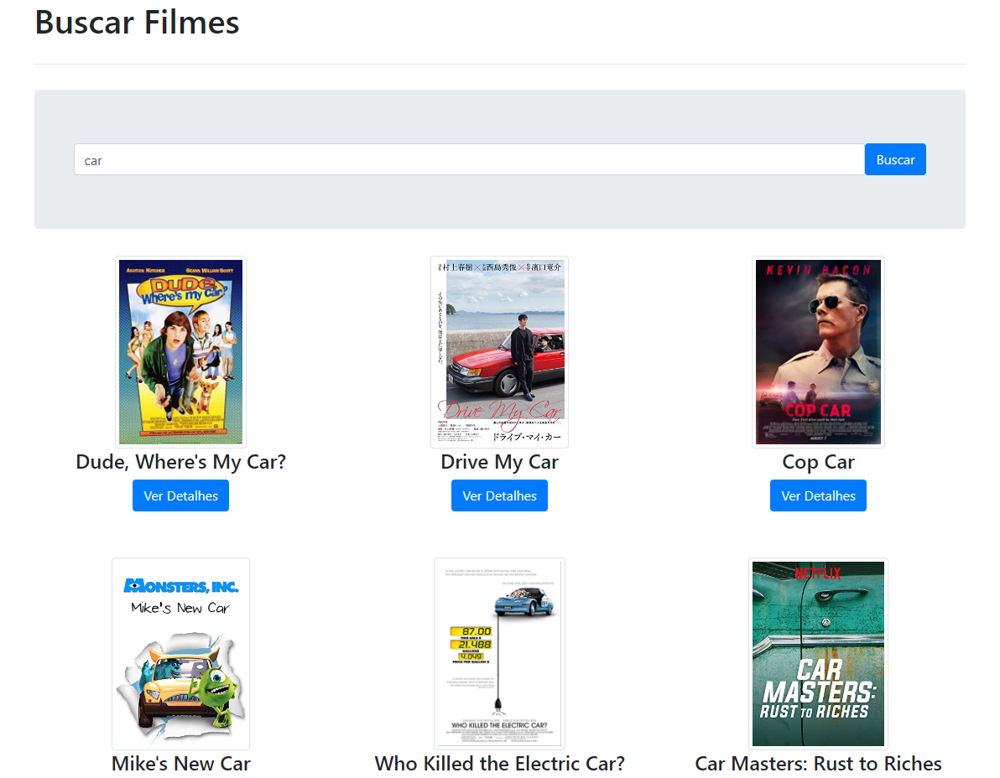
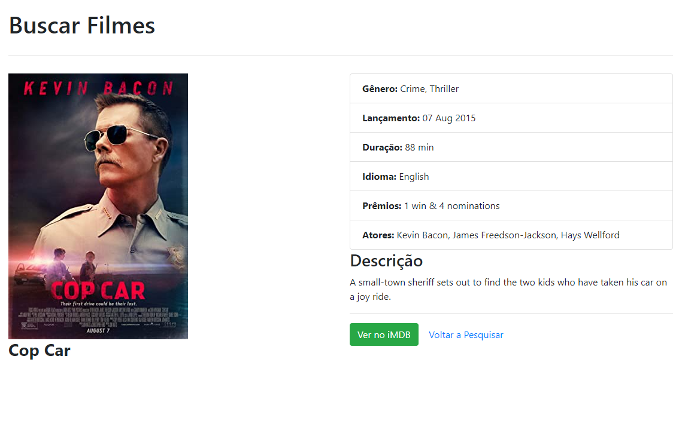

<h1 align="center">Consumindo API de Filmes</h1>
<h4 align="center">Aplicação que consome API utilizando a biblioteca Axios</h4> &#xa0;

**<p align="center">Sumário</p>**
<p align="center">
<a href="#dart-sobre">Sobre</a> &#xa0; | &#xa0;
<a href="#books-O-que-eu-aprendi">O que aprendi</a> &#xa0; | &#xa0;
<a href="#white_check_mark-funcionalidades">Funcionalidades</a> &#xa0; | &#xa0;
<a href="#computer-tecnologias">Tecnologias</a>
</p>
<p align="center">
<a href="#hammer_and_wrench-serviços">Serviços</a> &#xa0; | &#xa0;
<a href="#scroll-rodando-o-projeto">Rodando o projeto</a> &#xa0; | &#xa0;
<a href="#sparkles-autor">Autor</a>
</p>

 &#xa0;
 
## :dart: Sobre
<p>O principal objetivo do projeto foi aprender a consumir API, utilizando a biblioteca Axios.</p>
<p>Praticando também a criação de elementos de forma Dinâmica.</p>
<p>Esse projeto <a href="http://www.omdbapi.com/">utiliza esta API</a>. Suas informações e instruções estão no seu README.</p>

### Deploy: https://viniciuslemos93.github.io/consumindo-api-filmes/

<div align="center">

</div>

<div align="center">

</div>


&#xa0;

## :books: O que eu aprendi?

📌 Como consumir uma API;

📌 Utilizar a biblioteca Axios;

📌 Utilizar o método GET com Axios;

📌 Gerar elementos HTML de forma dinâmica;

&#xa0;

## :white_check_mark: Funcionalidades
A principal funcionalidade do projeto é:

✔️ Trazer o resultado da pesquisa conforme nome do filme que pesquisar;


&#xa0;

## :computer: Tecnologias
* [HTML](https://developer.mozilla.org/pt-BR/docs/Web/HTML)

* [JavaScript](https://www.javascript.com/)

* [Axios](https://axios-http.com/ptbr/)

* [CSS](https://www.w3schools.com/css/)

* [Bootstrap](https://getbootstrap.com/)

&#xa0;

## :hammer_and_wrench: Serviços
* <a href="https://github.com/">GitHub</a>


&#xa0;

## :scroll: Rodando o projeto
É necessário um navegador

```bash
# Clone este repositório
$ git clone https://github.com/viniciuslemos93/consumindo-api-filmes.git

# Acesse a pasta do projeto e abra o arquivo index.html no navegador
```

&#xa0;


## :sparkles: Autor

<h4>Desenvolvido por Vinicius Lemos</h4>

<a href="https://github.com/viniciuslemos93">

</a>

&#xa0;

[](https://www.linkedin.com/in/viniciuslemos93/)<br>
